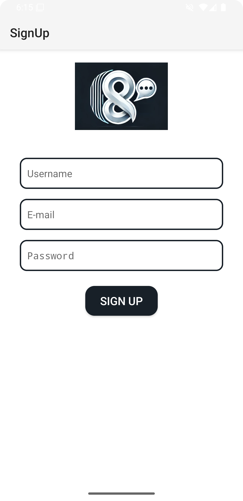
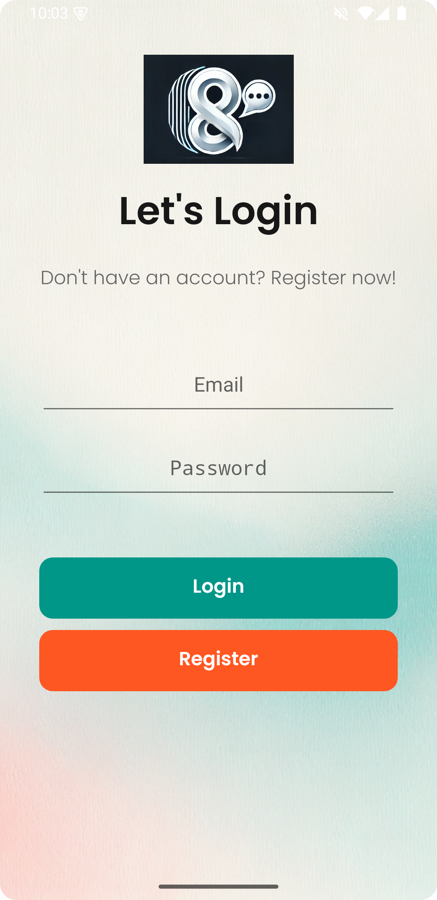
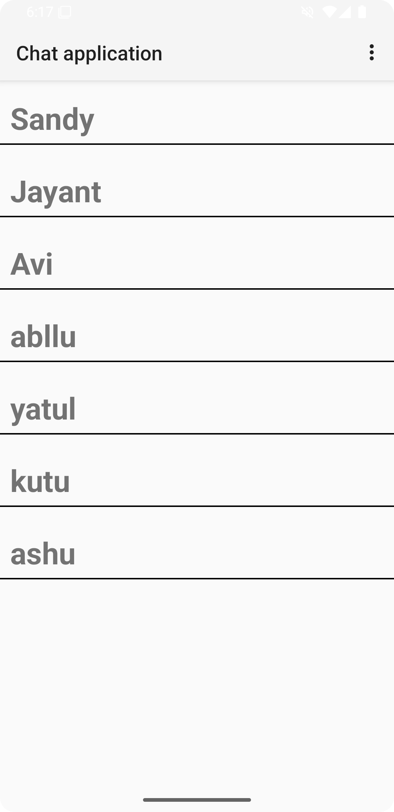
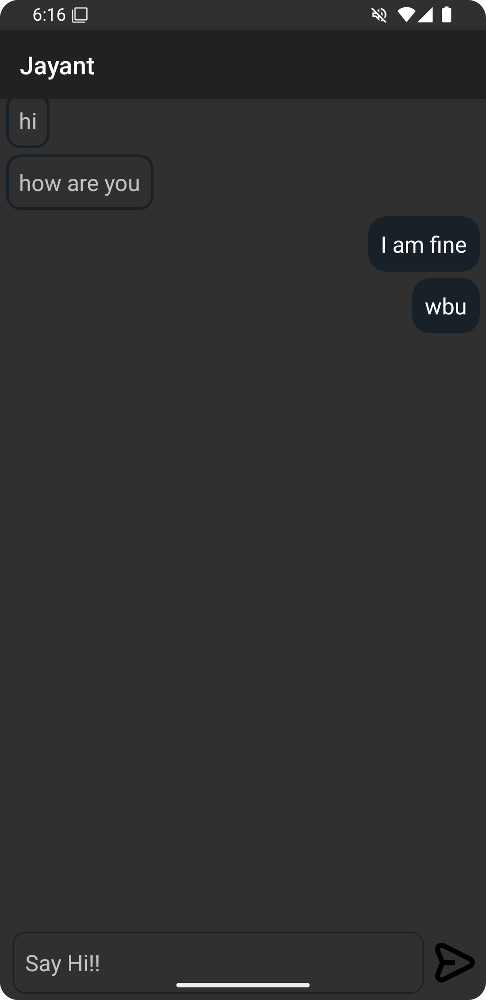

#  8OGChat

**8OGChat** is a Firebase-powered Android chat application that allows users to communicate in real-time with a clean and modern UI.



---

##  Features

- 🔄 **Real-Time Messaging** – Instantly chat with other users
- 🔐 **Secure Authentication** – Sign up and login using Firebase
- ☁️ **Cloud Storage** – Messages are stored and synced via Firebase Realtime Database
- 💬 **Simple UI** – Intuitive layout with styled input and buttons

---

##  Tech Stack

- **Language**: Kotlin  
- **Backend**: Firebase Authentication & Realtime Database  
- **UI**: XML Layouts 

##  Screenshots

<p align="center">
  
  
  
  
</p>


## 🚀 Getting Started

### 1. Clone the Repository

```bash
git clone https://github.com/AvinashKhichar/8OGChat.git
cd 8OGChat
```

---

### 2. Open the Project in Android Studio

- Launch **Android Studio**
- Click on `File > Open` and select the `8OGChat` folder
- Let Gradle sync and build the project

---

### 3. Firebase Setup

To enable login and real-time chat features, you need to connect to Firebase.

#### 📥 Add `google-services.json`:

1. Go to [Firebase Console](https://console.firebase.google.com/)
2. Create a new Firebase project
3. Register your Android app (use your package name)
4. Download `google-services.json`
5. Place it inside:  
   ```
   app/google-services.json
   ```

---

### 4. Gradle Configuration (Kotlin DSL)

#### 📁 Project-level `build.gradle.kts`:

```kotlin
buildscript {
    dependencies {
        classpath("com.google.gms:google-services:4.3.15")
    }
}
```

If you're using the `plugins` block:
```kotlin
plugins {
    id("com.android.application") version "8.3.1" apply false
    id("com.google.gms.google-services") version "4.3.15" apply false
}
```

---

#### 📁 App-level `build.gradle.kts`:

```kotlin
plugins {
    id("com.android.application")
    id("com.google.gms.google-services")
    kotlin("android")
}

dependencies {
    implementation("com.google.firebase:firebase-auth:22.3.0")
    implementation("com.google.firebase:firebase-database:20.3.0")
}
```

---

### ✅ You're Ready to Go!

- Connect a device or emulator  
- Click **Run ▶️** in Android Studio  
- Start chatting in real-time 🚀

---

## 💡 How to Use

1. **Sign Up** with your username, email, and password
2. **Login** to access the chat screen
3. **Send messages** in real-time
4. (Upcoming) Upload your profile picture

---

## 📁 Project Structure

```
app/
├── activities/         # Screens (Login, Signup, Chat)
├── adapters/           # RecyclerView Adapters
├── models/             # Data classes: User, Message
├── layout/             # XML UI files
├── drawable/           # Custom shapes & backgrounds
└── utils/              # Helper classes (optional)
```

---


## 🙌 Contributing

Contributions are welcome!  
Just fork the repo, create a new branch, and open a PR.

```bash
git checkout -b feature/amazing-feature
git commit -m "Added something awesome"
git push origin feature/amazing-feature
```

---

## 📄 License

This project is open-source and available under the [MIT License](LICENSE).

---

## 💬 Contact

Got questions, suggestions, or feedback?  
👉 [Open an issue](https://github.com/AvinashKhichar/8OGChat/issues)

---
